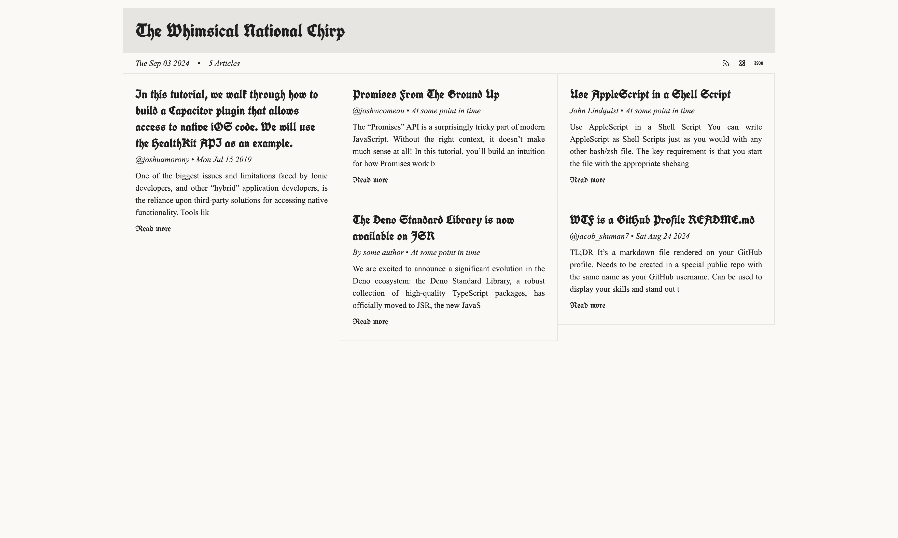

<picture>
	<source media="(prefers-color-scheme: dark)" srcset="./static/favicon-light.svg" />
	
</picture>

# readl8r

> A no-nonsense read later service

## :star: Features

- :heavy_plus_sign: [Add an article](#heavy_plus_sign-add-an-article) by making a `POST` request (with `url` in a `JSON` body) to `/articles/add`.
- :clipboard: [Get a `JSON` array of all articles](#clipboard-get-a-json-array-of-all-articles) by making a `GET` request to `/articles`.
- :no_entry_sign: [Remove all articles](#no_entry_sign-remove-all-articles) by making a `DELETE` request to `/articles/clear`.
- :file_cabinet: All articles are stored in a `/data/local.sqlite` SQLite database.
- :inbox_tray: Get an [RSS](https://www.rssboard.org/rss-specification), [Atom](https://validator.w3.org/feed/docs/atom.html), and [JSON](https://www.jsonfeed.org/) feed of articles at [`/rss`](#inbox_tray-generate-rss2-feed-from-articles), [`/atom`](#inbox_tray-generate-atom-feed-from-articles), and [`/json`](#inbox_tray-generate-json-feed-from-articles) respectively.

<picture>
	<source media="(prefers-color-scheme: dark)" srcset="./screenshots/home-dark.jpeg" />
	
</picture>

## :rocket: Getting started

### :ship: Docker Compose

Although you can clone/build readl8r locally, it's recommended for users to run the [docker image on Docker Hub](https://hub.docker.com/r/jacobshuman/readl8r). Copy the contents of this [docker-compose.yml](./docker-compose.yml) file to your computer and run:

```bash
docker compose up
```

### :palm_tree: Environment variables

| Name               | Required             | Description                                                                    | Default     |
| ------------------ | -------------------- | ------------------------------------------------------------------------------ | ----------- |
| `AUTH_SECRET`      | If `PASSWORD` is set | Used to sign auth JWTs                                                         | `undefined` |
| `HOST`             | No                   | Hostname or IP address where the service is hosted                             | `0.0.0.0`   |
| `PORT`             | No                   | The port number used for the service                                           | `80`        |
| `SECURE`           | No                   | Indicates whether to use HTTPS (true) or HTTP (false)                          | `false`     |
| `PASSWORD`         | No                   | Password required for authentication                                           | `undefined` |
| `FEED_TITLE`       | No                   | Title of the feed (displayed on the web app)                                   | `undefined` |
| `FEED_DESCRIPTION` | No                   | Brief description of the feed's content and purpose (displayed on the web app) | `undefined` |
| `FEED_IMAGE`       | No                   | URL to an image that represents the feed (e.g., logo or banner)                | `undefined` |
| `FEED_FAVICON`     | No                   | URL to the favicon to be displayed in browsers for the feed                    | `undefined` |
| `FEED_COPYRIGHT`   | No                   | Copyright information regarding the content of the feed                        | `undefined` |
| `AUTHOR_NAME`      | No                   | Name of the feed's author                                                      | `undefined` |
| `AUTHOR_EMAIL`     | No                   | Email address of the author                                                    | `undefined` |
| `AUTHOR_LINK`      | No                   | URL to the author's website or social media profile                            | `undefined` |

### :lock: Authentication

You can **optionally** protect your reading list with a password by setting the `PASSWORD` and `AUTH_SECRET` env variables in your compose config. This will protect all routes excluding feed routes (`/rss`, `/atom`, etc). I'm still looking into how rss aggregators generally handle auth for feeds and only want to add auth when it doesn't prevent aggregators from accessing reading lists.

## Stucture of an article

```ts
{
	id: number;
	url: string;
	publish_date: string; // date article was published (added_date if this can't be found)
	added_date: string; // date the article was added to readl8r
	title: string | null;
	description: string | null;
	content: string | null;
	author: string | null;
	favicon: string | null;
	ttr: number | null; // estimated time to read article in seconds
}
```

## :heavy_plus_sign: Add an article

**Requires Authentication**

You can add an article by providing the article's url in the body of a `POST` request:

`POST (http|https)://HOST:PORT/articles/add`

### :weight_lifting: body

```jsonc
{
	// required
	"url": "https://dev.to/jacobshuman/wtf-is-a-github-profile-readmemd-1p8c"
}
```

<!-- ```jsonc
{
	// required
	"url": "https://dev.to/jacobshuman/wtf-is-a-github-profile-readmemd-1p8c",

	// optional
	"title": "WTF is a GitHub Profile README.md",
	"description": "What is a profile README and why would I want one?",
	"author": "Jacob Shuman",
	"content": "",
	"date": ""
}
``` -->

### Responses

| Status | StatusText                               | Body        | Content-Type       |
| ------ | ---------------------------------------- | ----------- | ------------------ |
| 200    | `article added successfully`             | `undefined` | `application/json` |
| 400    | `url is required`                        | `undefined` | `undefined`        |
| 400    | `Unable to extract metadata at "${url}"` | `undefined` | `undefined`        |

## :page_facing_up: Get a single `JSON` article

**Requires Authentication**

You can get a single `JSON` object representing an article by making a `GET` request to the `/articles/:id` route:

`GET (http|https)://HOST:PORT/articles/:id`

### Responses

| Status | StatusText                           | Body        | Content-Type       |
| ------ | ------------------------------------ | ----------- | ------------------ |
| 200    | `undefined`                          | `Article`   | `application/json` |
| 404    | `there is no article with id of :id` | `undefined` | `undefined`        |

## :clipboard: Get a `JSON` array of all articles

**Requires Authentication**

You can get a `JSON` array of articles by making a `GET` request to the `/articles` route:

`GET (http|https)://HOST:PORT/articles`

### Responses

| Status | StatusText  | Body        | Content-Type       |
| ------ | ----------- | ----------- | ------------------ |
| 200    | `undefined` | `Article[]` | `application/json` |

## :memo: Update an article

**Requires Authentication**

You can update an article based on it's id by making a `POST` request to the `/articles/:id/update` route:

`POST (http|https)://HOST:PORT/articles/:id/update`

### :weight_lifting: body

```jsonc
{
	"article": {
		"url": "", // optional
		"publish_date": "", // optional
		"added_date": "", // optional
		"title": "", // optional
		"description": "", // optional
		"content": "", // optional
		"author": "", // optional
		"favicon": "", // optional
		"ttr": "" // optional
	}
}
```

### Responses

| Status | StatusText                           | Body        | Content-Type |
| ------ | ------------------------------------ | ----------- | ------------ |
| 200    | `article :id deleted successfully`   | `undefined` | `undefined`  |
| 404    | `there is no article with id of :id` | `undefined` | `undefined`  |

## :wastebasket: Delete an article

**Requires Authentication**

You can delete an article based on it's id by making a `DELETE` request to the `/articles/:id/delete` route:

`DELETE (http|https)://HOST:PORT/articles/:id/delete`

### Responses

| Status | StatusText                           | Body        | Content-Type |
| ------ | ------------------------------------ | ----------- | ------------ |
| 200    | `article :id deleted successfully`   | `undefined` | `undefined`  |
| 404    | `there is no article with id of :id` | `undefined` | `undefined`  |

## :wastebasket: Remove all articles

**Requires Authentication**

`Content-Type: application/xml+rss`

`DELETE (http|https)://HOST:PORT/articles/clear`

### Responses

| Status | StatusText                      | Body        | Content-Type |
| ------ | ------------------------------- | ----------- | ------------ |
| 200    | `articles cleared successfully` | `undefined` | `undefined`  |

## :inbox_tray: Generate RSS2 feed from articles

`GET (http|https)://HOST:PORT/rss`

`GET (http|https)://HOST:PORT/rss.xml`

`GET (http|https)://HOST:PORT/feed`

`GET (http|https)://HOST:PORT/feed.xml`

### Responses

| Status | StatusText  | Body     | Content-Type          |
| ------ | ----------- | -------- | --------------------- |
| 200    | `undefined` | RSS Feed | `application/rss+xml` |

## :inbox_tray: Generate Atom feed from articles

`GET (http|https)://HOST:PORT/atom`

### Responses

| Status | StatusText  | Body      | Content-Type           |
| ------ | ----------- | --------- | ---------------------- |
| 200    | `undefined` | Atom Feed | `application/atom+xml` |

## :inbox_tray: Generate JSON feed from articles

`GET (http|https)://HOST:PORT/json`

### Responses

| Status | StatusText  | Body      | Content-Type       |
| ------ | ----------- | --------- | ------------------ |
| 200    | `undefined` | JSON Feed | `application/json` |
